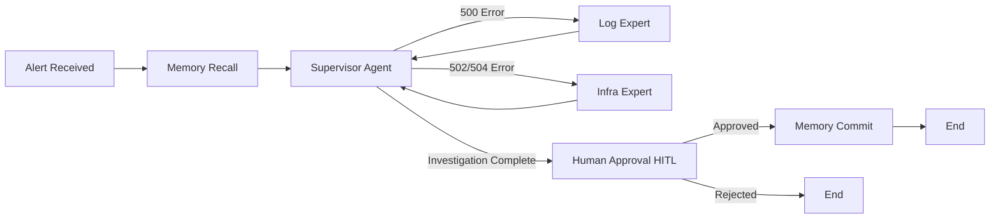

# Auto-Healer Agent

> A local, autonomous DevOps/SRE AI agent for automatic troubleshooting of microservice 5xx errors

[](https://www.python.org/downloads/)
[](https://opensource.org/licenses/MIT)
[](http://mypy-lang.org/)
[](https://github.com/astral-sh/ruff)

## Overview

Auto-Healer Agent is an open-source AI system that autonomously troubleshoots and performs Root Cause Analysis (RCA) on microservice 5xx errors (500, 502, 504). Built on LangGraph with local execution using Ollama, it ensures complete data privacy with zero API costs.

**Key Features:**
- 🤖 Multi-agent collaboration (Supervisor-Worker pattern)
- 🧠 Long-term memory using RAG (ChromaDB)
- 🛠️ Tool use for Docker log analysis and container health checks
- 🔄 ReAct pattern for iterative reasoning
- 🔍 Self-correction and reflection capabilities
- 👤 Human-in-the-loop approval gates
- 🔒 100% local execution (no data leaves your machine)

## Architecture

### High-Level Workflow



### Agent Specialization

**Supervisor Agent** (Router)
- Analyzes alert context and historical patterns
- Routes to appropriate specialist
- Uses Pydantic structured outputs (prevents hallucination)
- Enforces per-agent consultation budgets

**Log Expert Agent** (Code-Level Debugging)
- Fetches container logs via Docker SDK
- Analyzes Python tracebacks and stack traces
- Identifies code bugs (ZeroDivisionError, KeyError, etc.)
- Reports file:line location of errors

**Infra Expert Agent** (Infrastructure Diagnosis)
- Checks container health and resource usage
- Detects OOM kills (exit code 137)
- Monitors restart counts and crashes
- Identifies infrastructure failures

### Tech Stack
- **Orchestration**: LangGraph state machine
- **LLM**: Ollama with qwen2.5:14b (14B parameters, local)
- **Memory**: ChromaDB vector database (RAG)
- **Tools**: Docker SDK for Python
- **Services**: FastAPI microservices
- **Containerization**: Docker/Podman

## Quick Start

### Prerequisites

1. **Ollama** (for local LLM)
   ```bash
   # Install Ollama: https://ollama.ai
   ollama pull qwen2.5:14b
   ollama serve
   ```

2. **Podman or Docker**
   ```bash
   # macOS: brew install podman
   # Linux: see https://podman.io/getting-started/installation
   ```

3. **Python 3.11+**
   ```bash
   python --version  # Should be 3.11 or higher
   ```

### Installation

```bash
# Clone the repository
git clone https://github.com/YOUR_USERNAME/auto-healer-agent.git
cd auto-healer-agent

# Install dependencies (using uv)
uv pip install -e .

# Or with pip
pip install -e .
```

### Running the Agent

1. **Start the dummy microservices**
   ```bash
   podman-compose up -d --build
   # Or with docker: docker-compose up -d --build
   ```

2. **Verify services are running**
   ```bash
   podman-compose ps
   curl http://localhost:8001/health
   ```

3. **Run the agent with a sample alert**
   ```bash
   python -m auto_healer.main --alert examples/alerts/alert_500_zerodivision.json
   ```

### Testing Chaos Scenarios

Trigger different error types for testing:

```bash
# 500 Internal Server Error (ZeroDivisionError)
curl 'http://localhost:8001/order?chaos_type=500_zerodivision'

# 502 Bad Gateway (upstream failure)
curl 'http://localhost:8001/order?chaos_type=502_bad_gateway'

# 504 Gateway Timeout (long-running request)
curl 'http://localhost:8001/order?chaos_type=504_gateway_timeout'
```

View logs to see the generated errors:
```bash
podman logs order-service
```

## 📚 Learning Path

Want to learn how this was built? We've created a comprehensive **5-phase tutorial series** (16-24 hours) that teaches you to build production-ready multi-agent AI systems from scratch.

**[→ Start Learning: Phase 1 Tutorial](tutorials/README.md)**

**What You'll Learn**:
- Build multi-agent AI systems with LangGraph
- Implement RAG memory with ChromaDB
- Configure local LLMs (Ollama, qwen2.5:14b)
- Design specialized AI agents (Supervisor-Worker pattern)
- Test and debug autonomous agents
- Deploy production-ready AI applications

**Tutorial Series**:
- 📖 [Phase 1: Infrastructure & Testing Environment](tutorials/LESSON_PHASE1.md) (2-3 hours)
- 📖 [Phase 2: Perception, Tools & Memory](tutorials/LESSON_PHASE2.md) (3-4 hours)
- 📖 [Phase 3: Multi-Agent Orchestration](tutorials/LESSON_PHASE3.md) (4-5 hours)
- 📖 [Phase 4: Integration Testing & HITL](tutorials/LESSON_PHASE4.md) (4-6 hours)
- 📖 [Phase 5: Production Polish](tutorials/LESSON_PHASE5.md) (3-4 hours)
- 📖 [Summary: Key Architectural Decisions](tutorials/SUMMARY.md) (30 min)

**Includes**:
- ✅ Step-by-step implementation (all 5 phases)
- ✅ Real bugs discovered & solutions
- ✅ Performance metrics & trade-offs
- ✅ Validation checkpoints at each step
- ✅ Hands-on exercises

**Prerequisites**: Python 3.12+, Docker, Ollama
**Time Commitment**: 16-24 hours (beginner to advanced)

See [tutorials/README.md](tutorials/README.md) for the complete learning path.

## Project Structure

```
auto-healer-agent/
├── auto_healer/           # Main agent package
│   ├── nodes/             # LangGraph agent nodes
│   │   ├── supervisor.py
│   │   ├── log_expert.py
│   │   └── infra_expert.py
│   ├── tools/             # Agent tools
│   │   └── docker_tools.py
│   ├── state.py           # Global state definition
│   ├── graph.py           # LangGraph orchestration
│   ├── memory.py          # ChromaDB integration
│   └── main.py            # Entry point
│
├── dummy_services/        # Mock microservices for testing
│   ├── order/
│   ├── payment/
│   └── inventory/
│
├── examples/              # Sample alerts and data
│   └── alerts/
│
├── tutorials/             # Educational lesson series
│   ├── README.md          # Learning path overview
│   ├── LESSON_PHASE1.md   # Phase 1: Infrastructure
│   ├── LESSON_PHASE2.md   # Phase 2: Tools & Memory
│   ├── LESSON_PHASE3.md   # Phase 3: Multi-Agent
│   ├── LESSON_PHASE4.md   # Phase 4: Integration
│   ├── LESSON_PHASE5.md   # Phase 5: Production
│   └── SUMMARY.md         # Architectural decisions
│
├── docs/                  # Documentation
│   ├── ARCHITECTURE.md
│   ├── AGENT_SPEC.md
│   ├── BLUEPRINT.md
│   ├── development/       # Development documentation
│   │   ├── PROGRESS.md
│   │   └── SUPERVISOR_IMPROVEMENTS.md
│   └── testing/           # Test results
│       ├── TESTING.md
│       ├── PHASE4_502_TEST.md
│       └── PHASE4_RESULTS.md
│
└── tests/                 # Unit tests
```

## Agentic Design Patterns

This project implements several advanced patterns from *"Agentic Design Patterns"*:

1. **Multi-Agent Collaboration**: Supervisor-Worker topology with specialized agents
2. **Tool Use / Function Calling**: Docker SDK for log fetching and health checks
3. **ReAct (Reason + Act)**: Iterative thinking and tool usage
4. **Long-Term Memory (RAG)**: ChromaDB for incident history recall
5. **Reflection / Self-Correction**: Error handling and LLM self-repair
6. **Human-in-the-Loop**: Approval gates before committing RCA reports

## Development

### Running Tests

```bash
# Unit tests (41 tests, all passing)
pytest tests/

# Type checking (strict mode, 0 errors)
mypy auto_healer/

# Code formatting and linting
ruff check auto_healer/
ruff format auto_healer/
```

### Development Workflow

See [docs/BLUEPRINT.md](docs/BLUEPRINT.md) for the complete development plan and milestones.

## Documentation

### Core Documentation
- [docs/ARCHITECTURE.md](docs/ARCHITECTURE.md) - Architecture decisions and rationale
- [docs/AGENT_SPEC.md](docs/AGENT_SPEC.md) - Agent personas and specifications
- [docs/BLUEPRINT.md](docs/BLUEPRINT.md) - Project execution plan

### Learning Resources
- [tutorials/](tutorials/) - Complete 5-phase tutorial series (16-24 hours)
- [tutorials/SUMMARY.md](tutorials/SUMMARY.md) - Key architectural decisions & trade-offs

### Development
- [docs/development/PROGRESS.md](docs/development/PROGRESS.md) - Development progress tracking
- [docs/development/SUPERVISOR_IMPROVEMENTS.md](docs/development/SUPERVISOR_IMPROVEMENTS.md) - Supervisor agent enhancements

### Testing
- [docs/testing/TESTING.md](docs/testing/TESTING.md) - Infrastructure testing results
- [docs/testing/PHASE4_RESULTS.md](docs/testing/PHASE4_RESULTS.md) - Phase 4 integration test results

## Hardware Requirements

- **Recommended**: Apple Silicon M3 Pro (36GB RAM)
- **Minimum**: 16GB RAM, 20GB free disk space
- **LLM Model**: qwen2.5:14b (~9GB model size, 16K context window)

## Why Local?

**Data Privacy**: Application logs often contain sensitive PII or proprietary business logic. Running locally ensures no data leaves your machine.

**Cost**: Zero API costs during development and heavy ReAct loop testing.

**Performance**: Apple Silicon's unified memory allows the entire model and KV cache to reside in VRAM, eliminating inference bottlenecks.

## Troubleshooting

### Common Issues

**Q: LLM errors or "connection refused"**
```bash
# Check if Ollama is running
ollama serve

# Check if model is available
ollama list

# Pull model if missing
ollama pull qwen2.5:14b
```

**Q: Docker/Podman errors "container not found"**
```bash
# Check if services are running
podman-compose ps

# Restart services if needed
podman-compose down
podman-compose up -d --build
```

**Q: ChromaDB "collection not found" or memory errors**
```bash
# ChromaDB persists to .chromadb/ directory
# Delete to reset memory
rm -rf .chromadb/
```

**Q: Agent loops infinitely or times out**
- Check agent consultation budgets (max 3 per agent)
- Increase recursion limit: `--max-iterations 20`
- Review logs for circular reasoning patterns

**Q: Context window truncation (agent misses errors in logs)**
- Verify `num_ctx=16384` in `llm_config.py`
- Default 2048 will silently truncate 100-line logs
- Check Ollama model configuration

**Q: Pre-commit hooks fail**
```bash
# Reinstall pre-commit hooks
pre-commit clean
pre-commit install

# Run manually
pre-commit run --all-files
```

## Contributing

This is a learning project demonstrating agentic design patterns. Contributions are welcome!

1. Fork the repository
2. Create a feature branch (`git checkout -b feature/amazing-feature`)
3. Commit your changes (`git commit -m 'feat: add amazing feature'`)
4. Push to the branch (`git push origin feature/amazing-feature`)
5. Open a Pull Request

**Development Guidelines:**
- Pre-commit hooks are configured and will run automatically on `git commit`
- Run tests: `pytest tests/`
- Type check: `mypy auto_healer/` (strict mode enforced)
- Format code: `ruff format auto_healer/`
- Lint: `ruff check auto_healer/ --fix`
- All checks must pass before commits are accepted

## License

MIT License - see LICENSE file for details

## Acknowledgments

- Inspired by *"Agentic Design Patterns: A Hands-On Guide to Building Intelligent Systems"* by Antonio Gulli
- Built with LangChain/LangGraph
- Local LLM powered by Ollama

## Status

✨ **Phase 5: Production Polish - Complete!** ✨

- ✅ Phase 1: Infrastructure & Chaos Mock - **Complete**
- ✅ Phase 2: Perception, Tools & Memory Layer - **Complete**
- ✅ Phase 3: Core Orchestration (LangGraph) - **Complete**
- ✅ Phase 4: Integration & HITL - **Complete**
- ✅ Phase 5: Polish & Documentation - **Complete**
  - ✅ Terminal UI with Rich library
  - ✅ Type checking (mypy strict mode - 0 errors)
  - ✅ Comprehensive type hints across all modules
  - ✅ Unit tests (pytest, 41 tests passing)
  - ✅ Code formatting (ruff)
  - ✅ Pre-commit hooks configured
  - ✅ Comprehensive documentation
  - ✅ Educational lesson series (complete - see [tutorials/](tutorials/))
