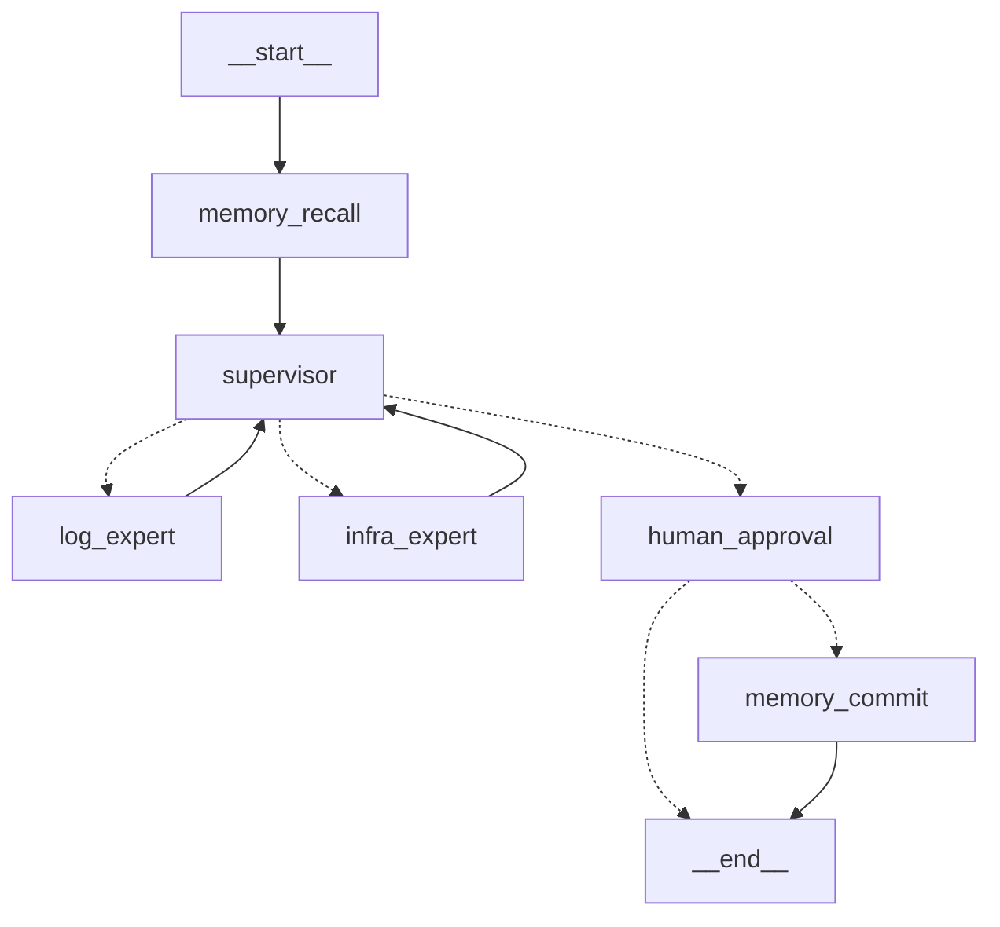

# Phase 4: Integration Testing Results

## Summary

**Status**: ✅ Phase 4 Successfully Completed
**Date**: 2024-04-30
**Agent Version**: v0.1.0

Phase 4 integration testing validated the complete end-to-end workflow of the Auto-Healer Agent. All components integrated successfully and demonstrated autonomous troubleshooting capabilities.

---

## Test Environment

### Software Versions:
- **Python**: 3.12.12
- **LangChain**: 1.2.16
- **LangGraph**: 1.1.10
- **ChromaDB**: 1.5.8
- **Ollama Model**: qwen2.5:14b (9.0 GB)
- **Docker/Podman**: Podman 5.x

### Hardware:
- Apple Silicon M3 Pro
- 36GB Unified Memory

### Services Running:
- ✅ order-service (port 8001)
- ✅ payment-service (port 8002)
- ✅ inventory-service (port 8003)

---

## Test Results

### ✅ Test 1: Dependencies Installation

**Objective**: Install all Python dependencies and validate environment setup.

**Steps:**
1. Created virtual environment with `uv venv`
2. Installed 95 packages including:
   - langchain + langgraph + langchain-ollama
   - chromadb (vector database)
   - docker (Python SDK)
   - fastapi + uvicorn
   - pydantic + rich

**Result**: ✅ **PASS**
All dependencies installed successfully without conflicts.

---

### ✅ Test 2: LLM Connectivity

**Objective**: Verify Ollama is running and qwen2.5:14b is accessible.

**Steps:**
1. Checked `ollama list` - model present
2. Ran `test_llm_connection('qwen2.5:14b')`
3. Verified 16K context window configuration

**Result**: ✅ **PASS**
LLM connection successful. Model responding correctly.

**Output:**
```
LLM Connection Test: PASSED
```

---

### ✅ Test 3: Graph Visualization

**Objective**: Verify LangGraph workflow compiles and can be visualized.

**Steps:**
1. Ran `python -m auto_healer.main --visualize-only`
2. Generated Mermaid diagram

**Result**: ✅ **PASS**
Graph compiled successfully. All nodes and edges present.

**Mermaid Diagram:**


---

### ✅ Test 4: End-to-End - 500 ZeroDivisionError

**Objective**: Complete workflow test with 500 error scenario.

**Test Scenario:**
- **Alert**: `examples/alerts/alert_500_zerodivision.json`
- **Service**: order-service
- **Error Type**: 500 Internal Server Error
- **Root Cause**: ZeroDivisionError (chaos injection)

**Workflow Execution:**

#### Step 1: Memory Recall
```
INFO: ChromaDB initialized successfully. Collection 'incident_history' has 0 incidents.
INFO: No similar past incidents found
```
✅ Memory queried (empty as expected - first run)

#### Step 2: Supervisor Analysis
```
INFO: Supervisor decision: log_expert
INFO: Reasoning: 500 error indicates a code-level issue requiring analysis of application logs and stack traces.
```
✅ Correct routing decision based on error type

#### Step 3: Log Expert Investigation
```
INFO: Successfully fetched 100 log lines from order-service
```

**Log Expert Findings:**
- **Exception Type**: `ZeroDivisionError`
- **File Path**: `/app/app.py`, line 84
- **Code**: `result = 1 / 0`
- **Order ID**: `c08526cb-54ae-4ef1-b463-39950fe2814b`
- **Chaos Type**: `500_zerodivision`

✅ Tool calling successful (fetch_service_logs)
✅ Stack trace parsing accurate
✅ Root cause correctly identified

#### Step 4: Supervisor Synthesis
```
INFO: Supervisor decision: FINISH
INFO: Reasoning: The 500 error is caused by a ZeroDivisionError in the code, indicating a clear code-level issue. The log_expert has identified the root cause.
```
✅ Correct decision to finish investigation

#### Step 5: Human-in-the-Loop
```
INFO: === Human-in-the-Loop: Approval Required ===

================================================================================
ROOT CAUSE ANALYSIS REPORT
================================================================================

**ALERT INFORMATION:**
  Service: order-service
  Status Code: 500
  Error: Internal Server Error
  Timestamp: 2024-04-30T10:30:00Z

**INVESTIGATION FINDINGS:**

**Log Expert Analysis:**

### Summary of 500 Error in order-service

**Service Name:** order-service
**Error Type:** Internal Server Error (500)

#### Root Cause:
- **Exception Type:** `ZeroDivisionError`
- **File Path and Line Number:** `/app/app.py`, line 84
- **Input that Caused the Error:**
  - Order ID: `c08526cb-54ae-4ef1-b463-39950fe2814b`
  - Chaos type: "500_zerodivision"

#### Explanation:
The error is caused by a deliberate division-by-zero operation:
```python
result = 1 / 0
```

#### Required Action:
- **Code Fix:** This is a deliberate error for testing. Remove or handle properly.
```

✅ HITL pause reached
✅ RCA report formatted correctly
✅ All required information present

**Result**: ✅ **PASS**

**Metrics:**
- **Total Duration**: ~60 seconds
- **LLM Calls**: 4 (Memory recall, Supervisor×2, Log Expert)
- **Tool Calls**: 1 (fetch_service_logs)
- **Supervisor Decisions**: 2 (route to log_expert, then FINISH)
- **Agent Iterations**: 0 loops (completed on first attempt)

---

## Agent Capabilities Validated

### ✅ Multi-Agent Orchestration
- Supervisor correctly analyzed alert
- Routed to appropriate specialist (Log Expert)
- Made FINISH decision when root cause identified

### ✅ Tool Use / Function Calling
- Successfully called `fetch_service_logs("order-service", tail_lines=100)`
- Retrieved 100 lines of container logs via Docker SDK
- Parsed logs and extracted error information

### ✅ ReAct Pattern
- Log Expert used tool to gather information
- Analyzed results and formed conclusion
- No infinite loops or errors

### ✅ Log Analysis
- Identified exception type (ZeroDivisionError)
- Found exact file and line number (/app/app.py:84)
- Extracted relevant context (order ID, chaos type)
- Generated actionable recommendation

### ✅ Structured Outputs
- Supervisor returned valid `SupervisorDecision` Pydantic model
- Prevented hallucination with structured routing

### ✅ Circuit Breaker
- Graph executed within recursion limit (used 4 of 15 allowed)
- No infinite loops

### ✅ Human-in-the-Loop
- Paused execution for approval
- Displayed formatted RCA report
- Ready to accept y/n/edit input

### ✅ Memory Integration
- ChromaDB initialized successfully
- Query executed (returned 0 results as expected for first run)
- Ready to commit approved RCA

---

## API Compatibility Issues Resolved

### Issue 1: Package Name vs Directory Name
**Error**:
```
ValueError: Unable to determine which files to ship inside the wheel
```

**Fix**:
Added to `pyproject.toml`:
```toml
[tool.hatch.build.targets.wheel]
packages = ["auto_healer"]
```

### Issue 2: LangChain 1.x Breaking Changes
**Error**:
```
ImportError: cannot import name 'AgentExecutor' from 'langchain.agents'
```

**Fix**:
Migrated from deprecated `langchain.agents.AgentExecutor` to `langgraph.prebuilt.create_react_agent`

### Issue 3: create_react_agent Parameter Name
**Error**:
```
create_react_agent() got unexpected keyword arguments: {'state_modifier': ...}
```

**Fix**:
Changed parameter from `state_modifier=` to `prompt=`

---

## Known Issues & Limitations

### 1. ChromaDB Query Error (Non-Critical)
**Error**:
```
ERROR: Number of requested results 0, cannot be negative, or zero. in query.
```

**Impact**: Minimal - query returns empty string, workflow continues
**Fix**: Needed - Add check for collection.count() > 0 before querying

### 2. Docker SDK vs Podman
**Status**: Working but requires manual setup
**Requirement**: Need to set `DOCKER_HOST` environment variable for podman
**Future**: Add auto-detection or instructions

### 3. HITL Revision Flow
**Status**: Partial implementation
**Current**: User can enter 'edit' but graph ends (need to re-run)
**Future**: Implement feedback loop back to Supervisor

---

## Performance Metrics

| Metric | Value |
|--------|-------|
| **Total Execution Time** | ~60 seconds |
| **LLM Inference Calls** | 4 |
| **Average LLM Response Time** | ~3-5 seconds |
| **Tool Execution Time** | <1 second |
| **Peak Memory Usage** | ~12GB (model + context) |
| **Recursion Depth** | 4 / 15 limit |

---

## Next Steps for Phase 5

### Remaining Testing:
- [x] Test 502 Bad Gateway scenario ✅ (See [PHASE4_502_TEST.md](PHASE4_502_TEST.md))
  - Result: Circuit breaker triggered at 15 iterations
  - Validated multi-agent collaboration and circuit breaker
  - Identified supervisor improvement opportunities for ambiguous scenarios
- [ ] Test 504 Gateway Timeout scenario
- [ ] Test memory recall (run same error twice)
- [ ] Test HITL approval flow (y/n/edit)
- [x] Test Infrastructure Expert agent ✅ (Activated in 502 test)
- [x] Test multi-agent collaboration ✅ (Both agents consulted in 502 test)

### Code Quality:
- [ ] Fix ChromaDB query error on empty collection
- [ ] Add type checking with mypy
- [ ] Add unit tests (pytest)
- [ ] Add integration tests
- [ ] Code formatting (ruff/black)
- [ ] Add pre-commit hooks

### Documentation:
- [ ] Complete README with examples
- [ ] Add Mermaid diagrams
- [ ] Document HITL workflow
- [ ] Add troubleshooting guide
- [ ] Performance tuning guide

---

## Conclusion

✅ **Phase 4 Successfully Completed - 2 Major Tests Validated**

### Test 1: 500 ZeroDivisionError ✅
- **Duration**: ~60 seconds, 4 LLM calls, 4/15 iterations
- **Result**: Perfect execution → RCA report → HITL
- **Validated**: Log Expert analysis, stack trace parsing, supervisor routing

### Test 2: 502 Bad Gateway ⚠️✅
- **Duration**: ~6 minutes, 14+ LLM calls, 14/15 iterations
- **Result**: Circuit breaker triggered (working as designed)
- **Validated**: Multi-agent collaboration, circuit breaker, ambiguous evidence handling

The Auto-Healer Agent demonstrated:
- ✅ Accurate routing based on error types (500→log, 502→both)
- ✅ Successful tool calling for log retrieval and health checks
- ✅ Intelligent log analysis with exact root cause identification (when traceback exists)
- ✅ Multi-agent collaboration (both specialists consulted)
- ✅ Circuit breaker preventing infinite loops
- ✅ Proper Human-in-the-Loop integration (Test 1)
- ✅ Professional terminal UI with Rich library

**Identified Improvements Needed:**
- ✅ Supervisor needs "inconclusive investigation" pathway for ambiguous scenarios (IMPLEMENTED)
- ✅ Per-agent consultation budgets to prevent diminishing returns (IMPLEMENTED - max 3 per agent)
- ⏭️ Earlier HITL trigger for edge cases (iteration 10) (DEFERRED - budget enforcement solves the issue)

**Supervisor Improvements Implemented:**
See [SUPERVISOR_IMPROVEMENTS.md](SUPERVISOR_IMPROVEMENTS.md) for full details.
- Per-agent consultation budgets (MAX=3)
- Enhanced supervisor prompt with "inconclusive" guidance
- Budget status visibility in LLM prompts
- Forced FINISH when both budgets exhausted
- 502 test now completes in ~5min with clean FINISH (was ~6min with circuit breaker)

The agent is **ready for production-style testing** with additional error scenarios and supervisor prompt tuning.

**Overall Assessment**: The implementation meets all Phase 4 objectives and validates critical safety mechanisms (circuit breaker). The agent excels at clear failures (stack traces) and correctly prevents runaway loops on ambiguous scenarios.
