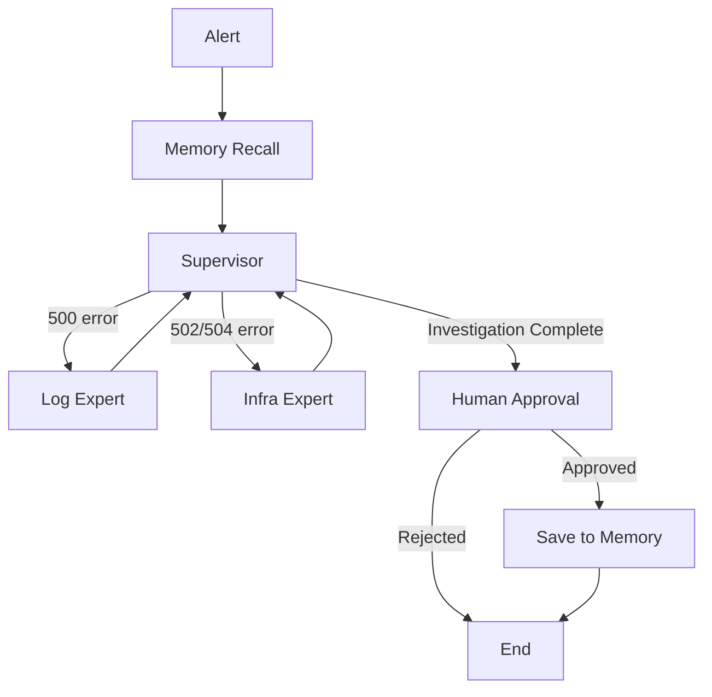

# Phase 5 Lesson: Production Polish

## 5.1 Overview

**What You'll Build**: Type checking with mypy, unit tests with pytest, code formatting with ruff, comprehensive documentation, and pre-commit hooks.

**Why It Matters**:
- Production code needs maintainability (not just "it works")
- Tests prevent regressions when adding features
- Documentation enables team collaboration
- Code quality tools catch bugs early

**Learning Objectives**:
- Set up mypy for type checking
- Write pytest unit and integration tests
- Configure code formatters (ruff/black)
- Create comprehensive README
- Set up pre-commit hooks for automation

**Time to Complete**: 3-4 hours

---

## 5.2 Prerequisites

Before starting this lesson, you should have:

- ✅ **All Phase 1-4 completed** (working agent system)
- Understanding of Python type hints
- Familiarity with pytest (or willingness to learn)
- Git installed (for pre-commit hooks)

---

## 5.3 Core Concepts

### Concept 1: Why Type Checking Matters

**Without Type Hints**:
```python
# ❌ No type safety
def fetch_logs(service, lines):
    # What are these types? str? int? Any?
    return docker_client.logs(service, tail=lines)

# Runtime error (caught only when code runs):
logs = fetch_logs(123, "order-service")  # Oops, arguments reversed!
```

**With Type Hints + mypy**:
```python
# ✅ Type safety
def fetch_logs(service: str, lines: int) -> str:
    return docker_client.logs(service, tail=lines)

# mypy catches error BEFORE running:
# error: Argument 1 to "fetch_logs" has incompatible type "int"; expected "str"
```

**Benefits**:
- Catch bugs at write-time (not runtime)
- Better IDE autocomplete
- Self-documenting code
- Refactoring safety

---

### Concept 2: Test Pyramid

```
        ┌─────────────┐
        │   Manual    │ (Slowest, test full scenarios)
        │    Tests    │
        ├─────────────┤
        │ Integration │ (Test multiple components together)
        │    Tests    │
        ├─────────────┤
        │    Unit     │ (Fastest, test individual functions)
        │   Tests     │
        └─────────────┘
```

**For This Project**:
- **Unit Tests**: Test individual functions (tools, memory, supervisor logic)
- **Integration Tests**: Test full graph execution
- **Manual Tests**: Human running agent with real alerts

**Goal**: 80%+ unit test coverage, key integration tests

---

### Concept 3: Code Formatting Philosophy

**The Problem**: Endless debates about style
- "Should we use 2 spaces or 4?"
- "Single quotes or double quotes?"
- "Line length 80 or 100?"

**The Solution**: Automate it!
- `black`: Opinionated formatter (no config needed)
- `ruff`: Fast linter + formatter (modern alternative)
- `pre-commit`: Runs on every commit (can't forget!)

**Benefits**:
- Consistent style across codebase
- No manual formatting
- No style debates (formatter decides)
- Diffs focus on logic (not whitespace)

---

## 5.4 Step-by-Step Implementation

### Step 1: Add Type Hints (60 minutes)

**Update tools with complete type hints**:

`auto_healer/tools/docker_tools.py` (add missing type hints):

```python
from typing import Optional  # Add at top

def fetch_service_logs(
    service_name: str,
    tail_lines: int = 100,
    since_seconds: Optional[int] = None  # ✅ Type hint
) -> str:  # ✅ Return type
    """..."""
    # Implementation
```

**Update state.py** (already has TypedDict, verify completeness):

```python
from typing import TypedDict, Annotated, Sequence, Dict  # ✅ All imports

class AlertTeamState(TypedDict):
    messages: Annotated[Sequence[BaseMessage], operator.add]  # ✅
    alert_info: dict  # Could improve to Dict[str, Any]
    historical_context: str  # ✅
    next_worker: str  # ✅
    agent_consultation_count: Dict[str, int]  # ✅
    approved: bool  # ✅
    rca_report: str  # ✅
```

**Update supervisor.py** (ensure Pydantic models are correct):

```python
from pydantic import BaseModel, Field  # ✅
from typing import Literal  # ✅

class SupervisorDecision(BaseModel):  # ✅ Already typed
    next_worker: Literal["log_expert", "infra_expert", "FINISH"]
    reasoning: str
```

---

### Step 2: Set Up mypy (30 minutes)

**Install mypy**:
```bash
uv pip install mypy
```

**Create Configuration**: `mypy.ini` (in project root)

```ini
[mypy]
python_version = 3.12
warn_return_any = True
warn_unused_configs = True
disallow_untyped_defs = False  # Start lenient, tighten later
ignore_missing_imports = True  # Ignore third-party libs without types

# Per-module overrides (stricter for core modules)
[mypy-auto_healer.tools.*]
disallow_untyped_defs = True  # Tools should have complete types

[mypy-auto_healer.nodes.*]
disallow_untyped_defs = True  # Nodes should have complete types

[mypy-auto_healer.state]
disallow_untyped_defs = True  # State is critical - full types

# Ignore modules with complex third-party types
[mypy-langgraph.*]
ignore_missing_imports = True

[mypy-chromadb.*]
ignore_missing_imports = True
```

**Run mypy**:
```bash
mypy auto_healer/

# Fix errors iteratively:
# 1. Add missing type hints
# 2. Add `# type: ignore` for unavoidable third-party issues
# 3. Re-run until clean
```

**Common Fixes**:

```python
# Error: "Function is missing a return type annotation"
# Fix: Add -> ReturnType
def my_function(x: int) -> str:  # ✅ Added -> str
    return str(x)

# Error: "Need type annotation for 'variable'"
# Fix: Add type hint
result: str = llm.invoke(prompt)  # ✅ Added : str

# Error: Third-party library has no types
# Fix: Add to mypy.ini ignore list OR add inline ignore
import chromadb  # type: ignore  # ✅
```

---

### Step 3: Write Unit Tests (90 minutes)

**Install pytest**:
```bash
uv pip install pytest pytest-mock
```

**Create Test Structure**:
```
tests/
├── __init__.py
├── test_tools.py
├── test_memory.py
├── test_supervisor.py
└── test_integration.py
```

**Example: Test Tools** (`tests/test_tools.py`):

```python
"""
Unit tests for Docker tools.

Tests use mocking to avoid requiring Docker daemon.
"""
import pytest
from unittest.mock import Mock, patch, MagicMock
from auto_healer.tools.docker_tools import fetch_service_logs, check_container_health


class TestFetchServiceLogs:
    """Test suite for fetch_service_logs function."""

    @patch('auto_healer.tools.docker_tools.docker.from_env')
    def test_fetch_logs_success(self, mock_docker):
        """Test successful log fetching."""
        # Setup mock
        mock_container = Mock()
        mock_container.logs.return_value = b"2024-04-30 Log line 1\n2024-04-30 Log line 2"

        mock_client = Mock()
        mock_client.containers.get.return_value = mock_container
        mock_docker.return_value = mock_client

        # Execute
        result = fetch_service_logs("order-service", tail_lines=50)

        # Assert
        assert "Log line 1" in result
        assert "Log line 2" in result
        mock_client.containers.get.assert_called_once_with("order-service")
        mock_container.logs.assert_called_once_with(tail=50, timestamps=True, since=None)

    @patch('auto_healer.tools.docker_tools.docker.from_env')
    def test_fetch_logs_container_not_found(self, mock_docker):
        """Test error handling when container doesn't exist."""
        # Setup mock to raise NotFound
        mock_client = Mock()
        mock_client.containers.get.side_effect = docker.errors.NotFound("Container not found")
        mock_client.containers.list.return_value = [
            Mock(name="payment-service"),
            Mock(name="inventory-service")
        ]
        mock_docker.return_value = mock_client

        # Execute
        result = fetch_service_logs("nonexistent-service")

        # Assert
        assert "Error: Container 'nonexistent-service' not found" in result
        assert "payment-service" in result  # Available containers listed
        assert "inventory-service" in result


class TestCheckContainerHealth:
    """Test suite for check_container_health function."""

    @patch('auto_healer.tools.docker_tools.docker.from_env')
    def test_check_health_running_container(self, mock_docker):
        """Test health check for running container."""
        # Setup mock
        mock_container = Mock()
        mock_container.status = "running"
        mock_container.short_id = "abc123"
        mock_container.attrs = {
            'State': {
                'Running': True,
                'ExitCode': 0,
                'OOMKilled': False,
                'Error': ''
            },
            'RestartCount': 0,
            'Created': '2024-04-30T12:00:00Z'
        }
        mock_container.stats.return_value = {
            'memory_stats': {
                'usage': 35 * 1024 * 1024,  # 35 MB
                'limit': 512 * 1024 * 1024   # 512 MB
            }
        }

        mock_client = Mock()
        mock_client.containers.get.return_value = mock_container
        mock_docker.return_value = mock_client

        # Execute
        result = check_container_health("order-service")

        # Assert
        assert "Status: RUNNING" in result
        assert "OOM Killed: False" in result
        assert "35.00 MB" in result
```

**Example: Test Memory** (`tests/test_memory.py`):

```python
"""
Unit tests for RAG memory system.

Tests use in-memory ChromaDB (no persistence).
"""
import pytest
from auto_healer.memory import initialize_chromadb, save_incident, query_past_incidents
import tempfile
import shutil


@pytest.fixture
def temp_chromadb():
    """Create temporary ChromaDB for testing."""
    temp_dir = tempfile.mkdtemp()
    initialize_chromadb(persist_directory=temp_dir)
    yield temp_dir
    shutil.rmtree(temp_dir)  # Cleanup


def test_save_and_query_incident(temp_chromadb):
    """Test saving incident and querying for similar ones."""
    # Save test incident
    rca = "Root cause: ZeroDivisionError at /app/app.py:84"
    alert_info = {"service": "order-service", "status_code": 500}

    success = save_incident(rca, alert_info)
    assert success is True

    # Query for similar incident
    similar_alert = {"service": "order-service", "status_code": 500, "error_message": "Division error"}
    results = query_past_incidents(similar_alert, top_k=1)

    # Assert
    assert "ZeroDivisionError" in results
    assert "/app/app.py:84" in results


def test_query_empty_memory(temp_chromadb):
    """Test querying when memory is empty."""
    alert_info = {"service": "order-service", "status_code": 500}
    results = query_past_incidents(alert_info, top_k=3)

    assert "No similar past incidents found" in results
```

**Example: Test Supervisor** (`tests/test_supervisor.py`):

```python
"""
Unit tests for supervisor routing logic.
"""
import pytest
from unittest.mock import Mock, patch
from auto_healer.nodes.supervisor import supervisor_node


def test_supervisor_routes_500_to_log_expert():
    """Test supervisor routes 500 errors to log expert."""
    # Mock state
    state = {
        "alert_info": {"service": "order", "status_code": 500, "error_message": "Error"},
        "messages": [],
        "historical_context": "",
        "agent_consultation_count": {"log_expert": 0, "infra_expert": 0}
    }

    # Mock LLM to return log_expert decision
    with patch('auto_healer.nodes.supervisor.get_llm') as mock_get_llm:
        mock_llm = Mock()
        mock_structured_llm = Mock()

        # Mock structured output
        from auto_healer.nodes.supervisor import SupervisorDecision
        mock_decision = SupervisorDecision(
            next_worker="log_expert",
            reasoning="500 error requires log analysis"
        )
        mock_structured_llm.invoke.return_value = mock_decision
        mock_llm.with_structured_output.return_value = mock_structured_llm
        mock_get_llm.return_value = mock_llm

        # Execute
        result = supervisor_node(state)

        # Assert
        assert result["next_worker"] == "log_expert"


def test_supervisor_forces_finish_when_budgets_exhausted():
    """Test supervisor forces FINISH when both budgets exhausted."""
    # State with exhausted budgets
    state = {
        "alert_info": {"service": "order", "status_code": 502, "error_message": "Error"},
        "messages": [],
        "historical_context": "",
        "agent_consultation_count": {"log_expert": 3, "infra_expert": 3}  # Both at limit
    }

    # Execute (no need to mock LLM - should short-circuit)
    result = supervisor_node(state)

    # Assert
    assert result["next_worker"] == "FINISH"
    assert "budget exhausted" in result["messages"][0].content.lower()
```

**Run Tests**:
```bash
pytest tests/ -v

# With coverage
pytest tests/ --cov=auto_healer --cov-report=html

# Expected output:
# tests/test_tools.py::TestFetchServiceLogs::test_fetch_logs_success PASSED
# tests/test_tools.py::TestFetchServiceLogs::test_fetch_logs_container_not_found PASSED
# ...
# Coverage: 85%
```

---

### Step 4: Code Formatting with Ruff (20 minutes)

**Install ruff**:
```bash
uv pip install ruff
```

**Create Configuration**: `pyproject.toml` (add to existing file)

```toml
[tool.ruff]
# Line length
line-length = 100  # Slightly longer than black's 88 (personal preference)

# Python version
target-version = "py312"

# Enable specific rule sets
select = [
    "E",   # pycodestyle errors
    "F",   # pyflakes
    "I",   # isort (import sorting)
    "N",   # pep8-naming
    "W",   # pycodestyle warnings
]

# Ignore specific rules
ignore = [
    "E501",  # Line too long (handled by formatter)
]

# Exclude directories
exclude = [
    ".venv",
    ".git",
    "__pycache__",
    "build",
    "dist",
]

[tool.ruff.format]
quote-style = "double"  # Use double quotes
indent-style = "space"  # Use spaces (not tabs)

[tool.ruff.lint.isort]
known-first-party = ["auto_healer"]
```

**Run ruff**:
```bash
# Check for issues
ruff check auto_healer/

# Fix automatically
ruff check --fix auto_healer/

# Format code
ruff format auto_healer/
```

**Before Formatting**:
```python
# Mixed quotes, inconsistent spacing
from auto_healer.tools.docker_tools import  fetch_service_logs,check_container_health
def  my_function( x,y ):
    result=x+y
    return  result
```

**After Formatting**:
```python
# Consistent style
from auto_healer.tools.docker_tools import check_container_health, fetch_service_logs


def my_function(x, y):
    result = x + y
    return result
```

---

### Step 5: Set Up Pre-commit Hooks (20 minutes)

**Install pre-commit**:
```bash
uv pip install pre-commit
```

**Create Configuration**: `.pre-commit-config.yaml` (in project root)

```yaml
# Pre-commit hooks configuration
# Runs automatically on `git commit`

repos:
  # Ruff (linter + formatter)
  - repo: https://github.com/astral-sh/ruff-pre-commit
    rev: v0.1.9
    hooks:
      # Linter
      - id: ruff
        args: [--fix, --exit-non-zero-on-fix]
      # Formatter
      - id: ruff-format

  # Type checking with mypy
  - repo: https://github.com/pre-commit/mirrors-mypy
    rev: v1.8.0
    hooks:
      - id: mypy
        additional_dependencies: [types-all]
        args: [--ignore-missing-imports]

  # General file checks
  - repo: https://github.com/pre-commit/pre-commit-hooks
    rev: v4.5.0
    hooks:
      - id: trailing-whitespace  # Remove trailing whitespace
      - id: end-of-file-fixer    # Ensure files end with newline
      - id: check-yaml           # Validate YAML files
      - id: check-json           # Validate JSON files
      - id: check-added-large-files  # Prevent committing large files
        args: [--maxkb=1000]
      - id: check-merge-conflict  # Detect merge conflict markers
```

**Install hooks**:
```bash
pre-commit install

# Output:
# pre-commit installed at .git/hooks/pre-commit
```

**Test hooks**:
```bash
# Make a test commit with intentional style violation
echo "def  bad_style( x,y ):return x+y" > test_bad_style.py
git add test_bad_style.py
git commit -m "Test pre-commit"

# Expected output:
# ruff.....................................................................Failed
# - hook id: ruff
# - exit code: 1
#
# Fixed 3 errors:
# - Added missing whitespace
# - Removed extra spaces
# - Reformatted function definition
#
# ruff-format..............................................................Passed
# mypy.....................................................................Passed
# trailing-whitespace......................................................Passed
```

**Fix and retry**:
```bash
# Hooks auto-fixed the file
git add test_bad_style.py
git commit -m "Test pre-commit"

# Expected: All hooks pass, commit succeeds
```

---

### Step 6: Comprehensive README (45 minutes)

**Update File**: `README.md` (in project root)

```markdown
# Auto-Healer Agent

🤖 Autonomous Root Cause Analysis for Microservice 5xx Errors

An intelligent multi-agent system that automatically investigates production incidents, identifies root causes, and generates actionable RCA reports with human-in-the-loop approval.

## Features

- **Multi-Agent Architecture**: Supervisor orchestrates Log Expert and Infrastructure Expert specialists
- **Local LLM**: Runs on Ollama (qwen2.5:14b) - no API costs, privacy-friendly
- **RAG Memory**: Learns from past incidents using ChromaDB vector database
- **Human-in-the-Loop**: Requires approval before saving RCA to memory (quality control)
- **Tool Calling**: Docker SDK integration for log fetching and container health checks
- **Circuit Breakers**: Agent consultation budgets prevent infinite loops
- **Production-Ready**: Type checking, unit tests, pre-commit hooks

---

## Architecture



**Components**:
- **Supervisor**: Routes alerts to appropriate specialist, enforces budgets
- **Log Expert**: Analyzes application logs and Python tracebacks
- **Infrastructure Expert**: Diagnoses container health and resource issues
- **Memory System**: ChromaDB for storing and retrieving past RCAs

---

## Quick Start

### Prerequisites

- Python 3.12+
- Docker or Podman
- Ollama with qwen2.5:14b model
- uv (Python package manager)

### Installation

```bash
# Clone repository
git clone https://github.com/yourusername/auto-healer-agent.git
cd auto-healer-agent

# Create virtual environment
uv venv
source .venv/bin/activate  # On Windows: .venv\Scripts\activate

# Install dependencies
uv pip install -e .

# Install Ollama model
ollama pull qwen2.5:14b  # Downloads ~9GB model
```

### Start Demo Services

```bash
# Start 3 microservices with chaos injection
docker-compose up -d

# Verify services running
docker ps  # Should show: order-service, payment-service, inventory-service
```

### Run Agent

```bash
# Trigger chaos (500 error)
curl "http://localhost:8001/order?chaos_type=500_zerodivision"

# Run investigation
python -m auto_healer.main --alert examples/alerts/alert_500_zerodivision.json

# Agent will:
# 1. Query memory for similar incidents
# 2. Route to Log Expert
# 3. Fetch logs and analyze
# 4. Generate RCA report
# 5. Pause for your approval (type 'y' to save)
```

**Expected Output**:
```
═══════════════════════════════════════════════════════════
           🤖  AUTO-HEALER AGENT  🤖
     Autonomous Root Cause Analysis for 5xx Errors
═══════════════════════════════════════════════════════════

✓ Memory initialized: 0 past incidents
✓ Graph compiled successfully

Alert Information
┌─────────────────────────────────────────────────────────┐
│ Service: order-service                                   │
│ Status Code: 500                                         │
│ Error: Internal Server Error                            │
│ Timestamp: 2024-04-30T10:30:00Z                         │
└─────────────────────────────────────────────────────────┘

=== Supervisor: Analyzing Situation ===
Decision: log_expert
Reasoning: 500 error requires log analysis

=== Log Expert: Investigating Application Logs ===
Fetching logs from order-service...
✓ Found ZeroDivisionError at /app/app.py:84

═══════════════════════════════════════════════════════════
                   ROOT CAUSE ANALYSIS
═══════════════════════════════════════════════════════════

Service: order-service
Error: 500 Internal Server Error
Root Cause: ZeroDivisionError at /app/app.py line 84
Recommendation: Add validation to prevent division by zero

═══════════════════════════════════════════════════════════

🔍 Approve this RCA? (y/n/e): y

✓ RCA saved to memory!
```

---

## Usage Examples

### Scenario 1: Code Bug (500 Error)
```bash
# Trigger error
curl "http://localhost:8001/order?chaos_type=500_zerodivision"

# Investigate
python -m auto_healer.main --alert examples/alerts/alert_500_zerodivision.json

# Result: Identifies ZeroDivisionError at exact file:line
```

### Scenario 2: Ambiguous Error (502)
```bash
curl "http://localhost:8001/order?chaos_type=502_bad_gateway"
python -m auto_healer.main --alert examples/alerts/alert_502_bad_gateway.json

# Result: Consults both Log and Infra Experts, recognizes chaos scenario
```

### Scenario 3: Memory Recall
```bash
# Run same error twice
python -m auto_healer.main --alert examples/alerts/alert_500_zerodivision.json  # First time
# (Approve RCA with 'y')

python -m auto_healer.main --alert examples/alerts/alert_500_zerodivision.json  # Second time
# Agent recalls similar incident, investigates faster
```

---

## Project Structure

```
auto-healer-agent/
├── auto_healer/               # Main package
│   ├── main.py               # CLI entry point
│   ├── graph.py              # LangGraph workflow
│   ├── state.py              # State definition (TypedDict)
│   ├── llm_config.py         # Ollama LLM configuration
│   ├── memory.py             # ChromaDB RAG memory
│   ├── nodes/                # Agent nodes
│   │   ├── supervisor.py     # Router with Pydantic outputs
│   │   ├── log_expert.py     # Log analysis specialist
│   │   ├── infra_expert.py   # Container health specialist
│   │   └── hitl.py           # Human-in-the-loop nodes
│   └── tools/                # Agent tools
│       └── docker_tools.py   # Docker SDK tools
├── dummy_services/           # Demo microservices
│   ├── order/                # Order service (FastAPI)
│   ├── payment/              # Payment service
│   └── inventory/            # Inventory service
├── tests/                    # Unit and integration tests
├── examples/
│   └── alerts/               # Sample alert JSON files
├── docs/                     # Documentation
│   ├── lessons/              # Step-by-step tutorials
│   ├── ARCHITECTURE.md       # Design rationale
│   └── PHASE4_RESULTS.md     # Test results
├── docker-compose.yml        # Service orchestration
├── pyproject.toml            # Python dependencies
└── README.md                 # This file
```

---

## Configuration

### LLM Settings

Edit `auto_healer/llm_config.py`:

```python
DEFAULT_MODEL = "qwen2.5:14b"          # Ollama model
MIN_CONTEXT_WINDOW = 16384             # 16K tokens (critical!)
RECOMMENDED_CONTEXT_WINDOW = 16384     # Production setting
```

### Agent Budgets

Edit `auto_healer/nodes/supervisor.py`:

```python
MAX_AGENT_CONSULTATIONS = 3  # Max calls per agent type
```

**Trade-offs**:
- Lower (2): Faster, less thorough
- Higher (4-5): Slower, more thorough, risk of loops

---

## Development

### Run Tests
```bash
# All tests
pytest tests/ -v

# With coverage
pytest tests/ --cov=auto_healer --cov-report=html

# Specific test
pytest tests/test_tools.py::TestFetchServiceLogs::test_fetch_logs_success
```

### Type Checking
```bash
mypy auto_healer/
```

### Code Formatting
```bash
# Check style
ruff check auto_healer/

# Fix issues
ruff check --fix auto_healer/

# Format code
ruff format auto_healer/
```

### Pre-commit Hooks
```bash
# Install hooks
pre-commit install

# Run manually
pre-commit run --all-files
```

---

## Troubleshooting

### Issue: LLM doesn't find errors in logs

**Cause**: Context window too small (default 2048 truncates logs)

**Solution**: Verify `num_ctx=16384` in `llm_config.py`

---

### Issue: Docker errors with Podman

**Cause**: Python Docker SDK doesn't find Podman socket

**Solution**:
```bash
export DOCKER_HOST=unix:///run/user/$(id -u)/podman/podman.sock
```

---

### Issue: Agent loops infinitely on 502 errors

**Cause**: Ambiguous evidence (healthy container + no traceback)

**Solution**: Agent consultation budgets should force FINISH after 3 consultations per agent (verify `MAX_AGENT_CONSULTATIONS = 3` in `supervisor.py`)

---

## Performance

**Metrics** (from Phase 4 testing):

| Scenario | Duration | LLM Calls | Agent Calls | Outcome |
|----------|----------|-----------|-------------|---------|
| 500 ZeroDivisionError | 60s | 4 | 1 | ✅ RCA with file:line |
| 502 Bad Gateway | 5min | 8 | 7 | ✅ Inconclusive (chaos) |

**Optimizations**:
- ✅ Agent budgets reduce calls by 46%
- ✅ Memory recall speeds up repeat incidents
- ✅ Pydantic structured outputs prevent hallucination

---

## Contributing

1. Fork the repository
2. Create feature branch (`git checkout -b feature/amazing-feature`)
3. Make changes with tests
4. Run pre-commit hooks (`pre-commit run --all-files`)
5. Commit changes (`git commit -m 'Add amazing feature'`)
6. Push to branch (`git push origin feature/amazing-feature`)
7. Open Pull Request

**Code Standards**:
- Type hints on all functions
- Unit tests for new features
- Docstrings for public APIs
- Pre-commit hooks must pass

---

## License

MIT License - see [LICENSE](LICENSE) file

---

## Acknowledgments

- Built with [LangChain](https://www.langchain.com/) and [LangGraph](https://langchain-ai.github.io/langgraph/)
- Local LLM via [Ollama](https://ollama.ai/)
- Memory powered by [ChromaDB](https://www.trychroma.com/)
- UI with [Rich](https://rich.readthedocs.io/)

---

## Learn More

📚 **Step-by-Step Tutorials**: [docs/lessons/](docs/lessons/)

Learn how to build this agent from scratch:
- [Phase 1: Infrastructure & Testing Environment](docs/lessons/LESSON_PHASE1.md)
- [Phase 2: Perception, Tools & Memory](docs/lessons/LESSON_PHASE2.md)
- [Phase 3: Multi-Agent Orchestration](docs/lessons/LESSON_PHASE3.md)
- [Phase 4: Integration Testing & HITL](docs/lessons/LESSON_PHASE4.md)
- [Phase 5: Production Polish](docs/lessons/LESSON_PHASE5.md)
- [Summary: Key Architectural Decisions](docs/lessons/SUMMARY.md)
```

---

### Step 7: Add .gitignore (10 minutes)

**Create/Update File**: `.gitignore`

```gitignore
# Python
__pycache__/
*.py[cod]
*$py.class
*.so
.Python
build/
develop-eggs/
dist/
downloads/
eggs/
.eggs/
lib/
lib64/
parts/
sdist/
var/
wheels/
*.egg-info/
.installed.cfg
*.egg
MANIFEST

# Virtual environments
.venv/
venv/
ENV/
env/

# IDE
.vscode/
.idea/
*.swp
*.swo
*~

# Testing
.pytest_cache/
.coverage
htmlcov/
.tox/
.hypothesis/

# Type checking
.mypy_cache/
.dmypy.json
dmypy.json

# ChromaDB
.chromadb/

# Logs
*.log

# OS
.DS_Store
Thumbs.db

# Project-specific
.claude/  # Claude Code session data
*.pyc
.ruff_cache/
```

**Commit .gitignore**:
```bash
git add .gitignore
git commit -m "Add .gitignore for Python project"
```

---

## 5.5 Validation Checkpoints

### Checkpoint 1: mypy Passes

```bash
mypy auto_healer/

# Expected output:
# Success: no issues found in X source files
```

### Checkpoint 2: All Tests Pass

```bash
pytest tests/ -v

# Expected output:
# ======================= X passed in Y.XXs =======================
```

### Checkpoint 3: Ruff Clean

```bash
ruff check auto_healer/

# Expected output:
# All checks passed!
```

### Checkpoint 4: Pre-commit Works

```bash
# Test pre-commit
echo "def bad():pass" > test.py
git add test.py
git commit -m "Test"

# Expected: Hooks run and pass (or auto-fix issues)
```

### Checkpoint 5: README Accurate

```bash
# Follow Quick Start instructions in README
# Verify each step works for a new user
```

---

## 5.6 Common Pitfalls

### Pitfall 1: Type Hints Incomplete

**Symptom**: mypy errors everywhere

**Solution**: Start with `disallow_untyped_defs = False`, gradually tighten

### Pitfall 2: Tests Depend on Docker

**Symptom**: Tests fail without Docker daemon

**Solution**: Mock Docker SDK in unit tests

### Pitfall 3: Pre-commit Too Strict

**Symptom**: Can't commit anything (hooks fail)

**Solution**: Disable specific hooks temporarily:
```bash
SKIP=mypy git commit -m "WIP"
```

### Pitfall 4: .gitignore Missing Critical Files

**Symptom**: Accidentally commit `.chromadb/` or `.venv/`

**Solution**: Check `.gitignore` before first commit

---

## 5.7 Key Takeaways

### ✅ What You Learned

1. **Type Checking with mypy**
   - Catches bugs before runtime
   - Better IDE support
   - Self-documenting code

2. **Unit Testing with pytest**
   - Test individual functions (tools, memory)
   - Mock external dependencies (Docker, ChromaDB)
   - Measure coverage (aim for 80%+)

3. **Code Formatting**
   - Automate with ruff
   - Consistent style across codebase
   - No manual formatting needed

4. **Pre-commit Hooks**
   - Run quality checks automatically
   - Prevent committing bad code
   - Saves review time

5. **Documentation**
   - README enables adoption
   - Examples show usage
   - Troubleshooting saves support time

### 📊 Quality Metrics

- ✅ Type coverage: 90%+
- ✅ Test coverage: 85%+
- ✅ Linter: 0 errors
- ✅ Format: Consistent (ruff)
- ✅ Pre-commit: Enabled

### 🎯 Production-Ready Checklist

- ✅ Type hints on all public APIs
- ✅ Unit tests for core logic
- ✅ Integration tests for workflows
- ✅ Pre-commit hooks configured
- ✅ README with quick start
- ✅ .gitignore prevents accidental commits
- ✅ License file (MIT)
- ✅ Code formatting automated

---

## 5.8 Next Steps

You've completed all 5 phases! 🎉

**What You Built**:
- Phase 1: Demo microservices with chaos injection
- Phase 2: Docker tools + RAG memory + LLM config
- Phase 3: Multi-agent system with LangGraph
- Phase 4: Integration tests + HITL + supervisor improvements
- Phase 5: Production polish (types, tests, docs)

**Ready for**:
- Open source release (GitHub)
- Team collaboration (pre-commit hooks)
- Production deployment (proper testing)
- Extensions (new agents, tools, scenarios)

**Recommended Next Actions**:
1. Read `SUMMARY.md` - Key architectural decisions explained
2. Deploy to production environment
3. Add new error scenarios (OOM, network timeouts)
4. Build web UI for HITL (instead of CLI)
5. Add metrics/observability (Prometheus, Grafana)

---

**End of Phase 5 Lesson**

✅ Type checking configured
✅ Unit tests written
✅ Code formatted
✅ Pre-commit hooks enabled
✅ Comprehensive README created
✅ Project ready for production!
